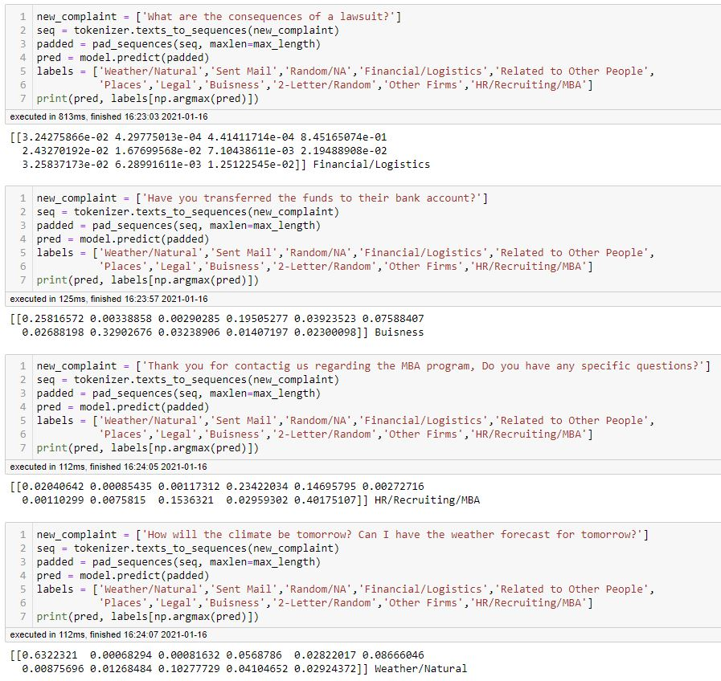

# Business Email Classifier

Multi-Class Email Text Classification Model built as part of UC Berkeley's INFO 154/254 - Data Mining and Analytics course. You can see more detailed information on the Multi_Class_Email_Text_Classification.pdf document.

## Directory Contents

### 1_Data_Preprocessing.ipynb

Contains all the code necessary for preprocessing the dataset including the KNN clustering that was performed for label reduction. Once the label reduction process was completed, a few manual edits were performed by inspecting the `vectorized_folders_df.csv`. You can read more about the manual edits in the `manual_label_edits.pdf` in the `Documents` folder. 

### 2_Clustering_Label_Visualization.ipynb

Contains the code used to generate visualization of the label embeddings using dimensionality reduction (using PCN and TSNE).

### 3_LSTM_Development.ipynb

Contains the code necessary for building the final LSTM model. Experimental architectures are not included in this repository.

### 4_LSTM_Live_Testing.ipynb

Contains a notebook that demonstrates how to use the last saved LSTM Model to do real time predictions by only typing a sentence. The classification is then returned.

### 5_Doc2Vec.ipynb

Contains code of the incomplete Doc2Vec model. The memory requirements were too big for the laptop. 

### Models

This directory contains the final LSTM `.h5` model and the `tokenizer.pickle` file use to tokenize text previous to inference. It also contains the pre-trained google embedding bin file.

### Datasets

The datasets use for training the model are stored here. The main ones are stored in a drive folder since they are too big to fit on github. You can download them <a href="https://drive.google.com/drive/folders/1mk04GMZgqG1pIXjEk1yyET0QDdlxf29A?usp=sharing">here.</a>

##  Dataset Description

The ENRON Email dataset used for training, testing, and validating was the Enron Email Dataset. This dataset contains 517401 rows corresponding to emails generated by employees at the Enron Corporation, mostly senior management. The raw dataset was originally published by the Federal Energy Regulatory Commission during the investigation of Enron’s collapse in December of 2001. The dataset was process before the release due to privacy and integrity issues. Some of the preprocessing done prior to the release were:
-	Deleted emails that would affect employees
-	Invalid email corrections (changing invalid email addresses to user@enron.com or in case of no recipient no_address@enron.com)
This is one of the few real email datasets in existence therefore we wanted to take advantage to build an email classification tool for enterprises/companies. The dataset, as mentioned previously, is made of 517401 rows and two columns: file and message. The file column contains the label information. By label information we mean the folder where the email was saved/placed. The message column contains information like the sender’s emails, receivers’ email, date, subject, if it contains bcc or cc or both, and the message text/content. There is a public code avaliable for parsing and extracting information from the dataset. This code was used to have a working dataset from which we could further do preprocessing and feature engineering. The dataset was received from https://www.cs.cmu.edu/~./enron/ and the public tool for extracting information was obtained from https://www.kaggle.com/donaldtfung/e-mail-categorization/. 

### Creating the Dataset Labels

The folder were the email was saved was taken as the label; however, some people create email folders and some others do not. Of the folders that were created the variety of unique folder names was very wide (over 1700 different folder names). Because of that, a KNN model was built under the hypothesis that similar labels embeddings should be clustered together (i.e. Places, Venues). At first the folder name embeddings were extracted using a word2vec model pretrained on the google news corpus. Then different values of n_components ranging from 3 to 11 were tested for the label clustering and reduction algorithm.  The n_components value with the best result was n = 10, which achieved a training set accuracy of 45.8% and test accuracy of 38.4% (after performing a train-test split on the training dataset). It is good practice for a KNN to have an odd value for n (so there will always be a majority vote), hence n = 11 in model tuning. The 11 clusters were analyzed and given unique names which became their new labels (see below)

- Weather/Natural Related
- Administrative/Office General
- Random NA
- Financial and Logistics
- Related to Other People
- Places
- Legal
- Business Arms/Functions
- 2-Letter
- Other Firms/Companies
- HR, Recruiting, MBA Programs

## ML Models 

A variety of models we're lightly tested including Decision Trees and Random Forests. Eventually due to limited performance in these models an LSTM model was trained and tested. See WRITEUP for more information. 

## Testing

The image below is a snippet of the model predicting given sentences. 

## Future Work

Doc2Vec has been found to boost accuracy in LSTM models. Due to the big memory requirements when fitting the embedding this was not tested but it is something to have in mind for future developments.